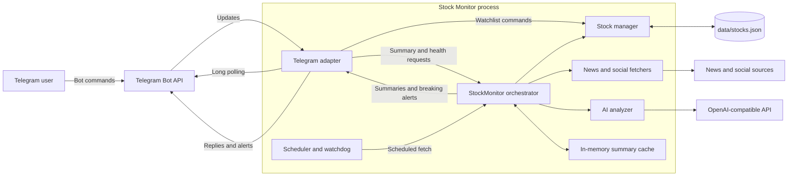

# Stock Monitor architecture

The application is a single long-running Python process. It receives Telegram commands through outbound long polling; it does not expose an HTTP endpoint or webhook.

Priority ranking affects only the watchlist displayed by `/list`. Background fetching continues to use the persisted watchlist order.
